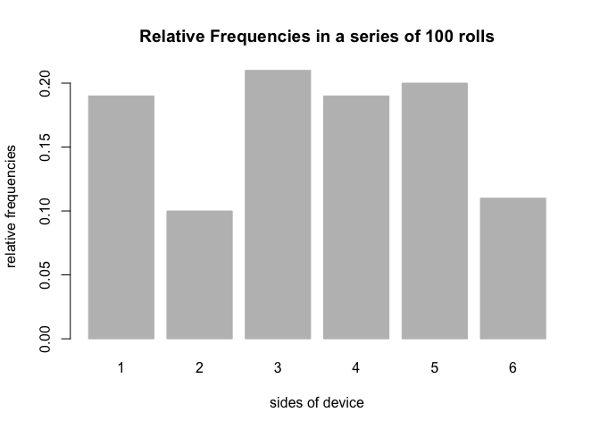

Workout 3 Tutorial
================
Ethan M.
December 2, 2018

``` r
library(roller)
```

    ## 
    ## Attaching package: 'roller'

    ## The following object is masked from 'package:graphics':
    ## 
    ##     plot

### General Information

This package is designed to simulate rolling a specificed `device()` a specified number of times.

### Device:

Users are able to specify any type of device, so long as the number of sides is greater than one and the probabilities obey the basic axioms of probability (i.e. are nonnegative, between 0 and 1, and sum to 1). The default is a fair "coin" with two sides ("1" and "2") of equal probability:

``` r
fair_coin <- device()
fair_coin
```

    ## object "device"
    ## 
    ##   sides prob
    ## 1     1  0.5
    ## 2     2  0.5

You can also specify nonstandard devices, of any length:

``` r
tri_die <- device(c("1", "2", "3"), prob = c(1/3, 1/3, 1/3))
tri_die
```

    ## object "device"
    ## 
    ##   sides      prob
    ## 1     1 0.3333333
    ## 2     2 0.3333333
    ## 3     3 0.3333333

 

### Rolls:

Users are also able to simulate rolling a device using the `roll()` function. The function takes an object of class "device" and rolls it a specified number of times (`times` must be a positive integer).

``` r
roll(fair_coin, 2)
```

    ## object 'rolls' 
    ## 
    ## $rolls
    ## [1] 2 2

``` r
roll(tri_die, 100)
```

    ## object 'rolls' 
    ## 
    ## $rolls
    ##   [1] "1" "3" "1" "2" "1" "1" "3" "1" "3" "2" "1" "2" "2" "1" "1" "2" "3"
    ##  [18] "2" "2" "1" "3" "1" "2" "3" "3" "2" "2" "2" "1" "3" "3" "1" "2" "1"
    ##  [35] "2" "3" "2" "3" "2" "1" "1" "2" "3" "2" "2" "1" "2" "1" "1" "3" "1"
    ##  [52] "2" "3" "1" "2" "3" "3" "1" "3" "3" "3" "3" "3" "1" "1" "3" "3" "3"
    ##  [69] "1" "2" "3" "2" "3" "3" "3" "1" "2" "1" "2" "2" "1" "2" "2" "3" "1"
    ##  [86] "3" "3" "2" "3" "1" "1" "2" "2" "3" "2" "2" "1" "3" "3" "2"

 

### Plotting:

This package comes with a default `plot()` function, which produces a frequency barchart of the rolls of a device.

``` r
die <- device(sides = 1:6, prob = rep(1/6, 6))
rolls100 <- roll(die, 100)
plot(rolls100)
```


